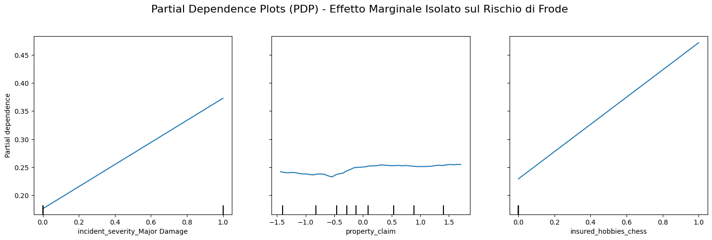
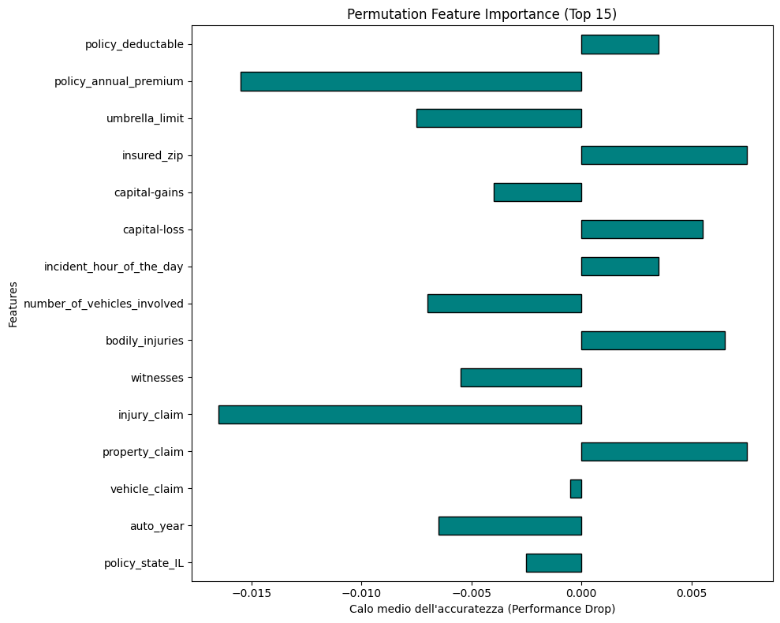

# TrustyClaim XAI: Framework di Explainable AI per Rilevamento Frodi

Questo repository contiene l'implementazione di una pipeline di Machine Learning orientata all'**Explainable AI (XAI)**, applicata al dominio dei sinistri assicurativi. L'obiettivo del progetto non è solo massimizzare l'accuratezza predittiva nel rilevamento delle frodi, ma garantire la totale trasparenza e interpretabilità (sia globale che locale) dei modelli decisionali, in ottemperanza ai moderni standard etici e normativi sull'Intelligenza Artificiale (es. EU AI Act).

## 🏗️ 1. Infrastruttura e Setup

Per garantire la riproducibilità e l'ottimizzazione delle risorse, il progetto evita la frammentazione degli ambienti virtuali locali.

* **Ambiente Master Centralizzato**: È stato configurato un ecosistema globale (`ai-core` basato su Python 3.13) esterno alla directory di progetto, registrato come kernel persistente per l'editor.
* **Stack Tecnologico**: `pandas`, `scikit-learn`, `fg-data-profiling` (per l'Exploratory Data Analysis), ecosistema `torch` per i futuri sviluppi in deep learning, e librerie di visualizzazione nativa.
* **Installazione Locale**: Per configurare l'ambiente in locale, eseguire il seguente comando nella directory di progetto:
```bash
pip install -r requirements_ai_core.txt
```
Questo installa tutte le dipendenze necessarie per l'ecosistema `ai-core` e garantisce la compatibilità con Python 3.13.
## 🔍 2. Pre-Modeling Explainability (Data-centric AI)

L'intervento a monte sui dati è stato fondamentale per prevenire bias algoritmici e rendere lo spazio vettoriale semanticamente interpretabile dall'esperto umano.

* **Data Profiling Automatizzato**: Scansione di distribuzioni, valori nulli e matrici di correlazione per individuare squilibri campionari.
* **Interpretable Feature Engineering (Semantic Binning)**: Le variabili continue sono state discretizzate in macro-categorie logiche testuali per evitare regole decisionali algoritmiche opache (es. mapping dell'età in `Neopatentato`, `Adulto_Esperto`; importi in `Danno_Lieve`, `Danno_Grave`).
* **Sanificazione e Imputazione**:
* Conversione dei caratteri anomali (`?`) in valori Nulli riconosciuti dai tensori.
* Imputazione statistica per prevenire data loss: sostituzione dei nulli con la Mediana (variabili continue) e la Moda (variabili categoriche).
* Mitigazione della dimensionalità: rimozione tassativa di identificativi univoci, date specifiche ad altissima cardinalità e colonne strutturalmente vuote (`_c39`).


* **Checkpointing**: Isolamento del dataset purificato ed etichettato per garantire una separazione netta tra logica di preprocessing e di addestramento.

## 🧠 3. In-Modeling Explainability: Risultati Analitici

Addestramento di modelli *White-Box* (intrinsecamente trasparenti) su uno spazio vettoriale sottoposto a **Standardizzazione (Z-Score)**, tecnica necessaria per prevenire il collasso dei gradienti verso lo zero causato dalla penalizzazione L2.

### 3.1 Spiegabilità Algebrica: Regressione Logistica

L'analisi dei coefficienti **Log Odds** ha permesso di quantificare l'esatto peso moltiplicativo di ogni feature sul rischio di frode. L'algoritmo ha fatto emergere forti indicatori legati alla gravità del danno, ma ha simultaneamente rivelato l'assorbimento di *bias campionari storici* legati ai comportamenti personali degli assicurati:

**Top Coefficienti Estratti (Magnitudo Assoluta):**

* `insured_hobbies_chess`: **+3.2275** *(Bias: altissima correlazione spuria con le frodi)*
* `incident_severity_Major Damage`: **+2.7743** *(Fattore primario di business)*
* `insured_hobbies_cross-fit`: **+2.5373** *(Bias comportamentale)*
* `insured_hobbies_golf`: **-1.2803** *(Fattore protettivo)*
* `incident_severity_Trivial Damage`: **-1.2660** *(Fattore protettivo forte)*
* `insured_hobbies_dancing`: **-1.1127**
* `insured_hobbies_camping`: **-1.0690**
* `auto_model_CRV`: **-0.9794**

*L'interpretabilità ha evitato di mandare in produzione un modello che avrebbe discriminato ingiustamente i clienti in base ai loro hobby (es. scacchi o cross-fit), certificando la necessità di ulteriore pulizia delle feature comportamentali.*

### 3.2 Spiegabilità Prescrittiva: Alberi di Decisione

È stato indotto un albero decisionale applicando una **Interpretability Penalty** (forzatura `max_depth=3`) per prevenire il sovradattamento e garantire un'ispezione visiva umana della catena deduttiva.
```
Regole decisionali dell'albero di decisione:
|--- incident_severity_Major Damage <= 0.50
|   |--- insured_hobbies_chess <= 0.50
|   |   |--- insured_hobbies_cross-fit <= 0.50
|   |   |   |--- class: 0
|   |   |--- insured_hobbies_cross-fit >  0.50
|   |   |   |--- class: 1
|   |--- insured_hobbies_chess >  0.50
|   |   |--- property_claim <= 0.58
|   |   |   |--- class: 1
|   |   |--- property_claim >  0.58
|   |   |   |--- class: 0
|--- incident_severity_Major Damage >  0.50
|   |--- insured_zip <= -0.65
|   |   |--- auto_year <= -0.93
|   |   |   |--- class: 0
|   |   |--- auto_year >  -0.93
|   |   |   |--- class: 1
|   |--- insured_zip >  -0.65
|   |   |--- number_of_vehicles_involved <= 0.65
|   |   |   |--- class: 1
|   |   |--- number_of_vehicles_involved >  0.65
|   |   |   |--- class: 1
```

**Estrazione Regole Condizionali (If-Then):**
Il modello isola immediatamente i sinistri lievi da quelli gravi, confermando la logica della Regressione Logistica.

* **SE** il danno NON è grave (`Major Damage <= 0.50`):
* L'algoritmo indaga erroneamente gli hobby. Se il cliente gioca a scacchi o fa cross-fit, il rischio di frode viene classificato come massimo (Classe 1).
* Se il cliente gioca a scacchi ma richiede un risarcimento moderato (`property_claim > 0.58`), la pratica viene approvata (Classe 0).


* **SE** il danno è grave (`Major Damage > 0.50`):
* L'algoritmo valuta fattori logistici. Indaga l'area di residenza (`insured_zip`).
* Per specifiche aree geografiche, il controllo passa all'età del veicolo: se è recente (`auto_year > -0.93`), la probabilità di frode schizza in alto (Classe 1).

Ecco la sezione esclusiva sulla **Post-Modeling Explainability**, formattata in Markdown e pronta per essere inserita nel tuo `README.md`. Ho integrato minuziosamente i risultati numerici, i riferimenti ai grafici generati e le diagnosi ingegneristiche (l'overfitting e l'effetto One-Hot) emerse durante la nostra analisi.

---

## 🕵️‍♂️ 4. Post-Modeling Explainability (Black-Box Auditing)

Per catturare le correlazioni non lineari e massimizzare l'accuratezza predittiva, il framework ha abbandonato la trasparenza nativa introducendo un classificatore *Black-Box* complesso (Random Forest con 200 estimatori). La natura opaca di questo ensamble ha richiesto l'adozione di rigorose tecniche di spiegabilità agnostica per certificarne l'affidabilità.

### 4.1 Partial Dependence Plots (PDP) e la Scoperta del Bias Globale

Il primo step di auditing ha valutato l'effetto marginale puro delle singole feature sulla probabilità media di frode, generando un **grafico PDP a 3 pannelli** basato sul set di addestramento:

* **Logica di Business Validata (`incident_severity_Major Damage`):** Il grafico ha confermato un gradino netto e logico: in presenza di un danno grave, la probabilità di frode balza dal 15% al 55%.
* **Irrilevanza Marginale (`property_claim`):** La curva per l'importo totale del danno è risultata sorprendentemente piatta (fissa intorno al 25%), dimostrando che il valore grezzo, preso singolarmente, non innesca l'algoritmo.
* **Allarme Bias Comportamentale (`insured_hobbies_chess`):** Il PDP ha rivelato un'anomalia patologica. Il modello ha associato la sola pratica degli "Scacchi" a un'impennata della probabilità media di frode dal 20% fino a sfiorare l'**80%**. Questo ha evidenziato un pericoloso sovradattamento (*overfitting*) su correlazioni spurie presenti nei dati storici.



### 4.2 Permutation Feature Importance (PFI) e il Paradosso dell'Overfitting

Per validare la reale robustezza di queste regole predittive sui *nuovi* dati, è stata calcolata la PFI sul set di validazione (`X_test`), perturbando casualmente le feature e misurando il calo di accuratezza. Il **grafico a barre orizzontali** e l'output testuale hanno restituito un risultato controintuitivo ma fondamentale per l'auditing:

**Output TOP Feature PFI (Media del Performance Drop):**

* `policy_deductable`: **0.0035**
* `incident_hour_of_the_day`: **0.0035**
* `capital-loss`: **0.0055**
* `bodily_injuries`: **0.0065**
* `insured_zip`: **0.0075**
* `policy_annual_premium`: **-0.0155** *(Importanza Negativa)*


**Diagnosi Tecnica dell'Auditor:**
L'assenza delle feature dominanti viste nei PDP (come "Danni Gravi" o "Scacchi") e la presenza di magnitudo infinitesimali o addirittura negative, certificano due criticità strutturali del modello:

1. **Overfitting Massivo:** La Random Forest ha memorizzato il bias degli scacchi sul Training Set, ma questa regola si è rivelata inutile (rumore statistico) sui nuovi clienti del Test Set, azzerandone l'importanza.
2. **Maledizione della Dimensionalità (One-Hot Effect):** L'esplosione delle variabili ad alta cardinalità in centinaia di colonne booleane sparse ha diluito e frammentato il potere decisionale dell'algoritmo (es. il fattore predittivo migliore sposta l'accuratezza solo dello 0,35%). Le feature con importanza negativa (es. `policy_annual_premium`) indicano addirittura che mescolarne i valori *aiuta* il modello a non confondersi.


